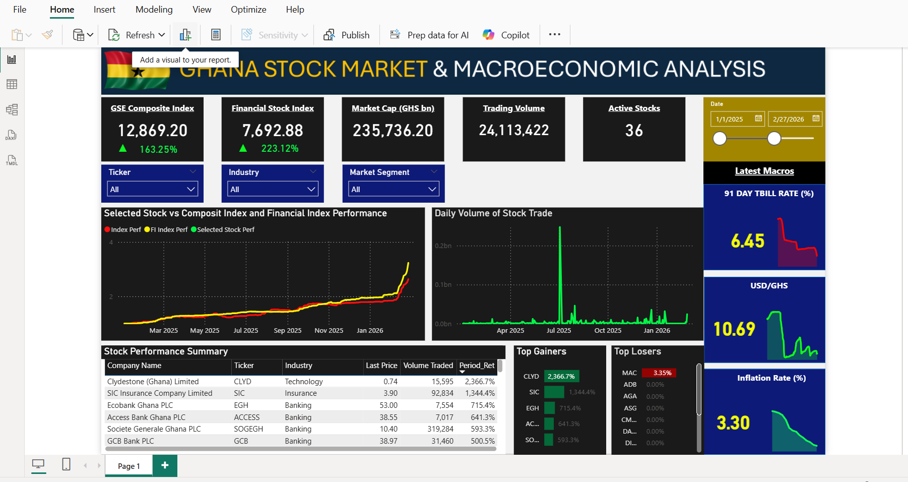

# Ghana Stock Market Trading & Price Analysis Dashboard

## Project Overview
This project analyzes trading activity and price movements on the Ghana Stock Exchange (GSE).  
The dashboard provides an interactive view of stock performance, trading volume, and market trends across listed companies.

Using Power BI, the project transforms raw trading data into a visual dashboard that helps users explore:

- Stock price trends over time
- Trading volume activity
- Sector performance
- Market breadth (advancing vs declining stocks)

The goal of this project is to demonstrate how financial market data can be transformed into actionable insights using data analytics tools.

---

## Dataset

The dataset contains daily trading information for companies listed on the Ghana Stock Exchange.

Key fields include:

- Date
- Share Code (Ticker)
- Closing Price
- Opening Price
- Volume Traded
- Value Traded
- Sector Classification

Data was sourced from the Ghana Stock Exchange historical trading records.

---

## Tools Used

- **Power BI** – Dashboard creation and data visualization  
- **Excel / Power Query** – Data cleaning and preparation  
- **DAX** – Measures for market indicators and performance metrics

---

## Dashboard Features

The dashboard includes several analytical components:

**Price Movement Analysis**
- Tracks the price performance of individual stocks over time.

**Sector Performance**
- Compares how different sectors of the market are performing.

**Market Breadth**
- Shows the number of advancing vs declining stocks in the market.

**Volume Trend Analysis**
- Visualizes trading activity to identify periods of high or low market participation.

**Interactive Filters**
- Users can filter the dashboard by stock ticker and date range.

---

## Dashboard Preview

---

## Dashboard Demo Video

Download and watch the dashboard demo showing how filters and visuals respond to user interaction.

[Download Dashboard Demo](MyVid.mp4)

---

## Key Insights

Some insights observed from the analysis include:

- Certain stocks dominate trading volume on the GSE.
- Price trends reveal periods of strong upward momentum in selected equities.
- Market breadth indicators highlight days when the majority of stocks moved in the same direction.
- Sector comparisons show where most market activity is concentrated.

---

## Author

**Jerry Nelson Cobbinah**  
Data Analyst | Finance & Investment Enthusiast

Portfolio: (your portfolio link)  
LinkedIn: (your linkedin link)
